# CPU_RT

A CPU side Ray-Tracer, constructed from much of Peter Shirley's Ray Tracing in one weekend serise: https://raytracing.github.io/

To then be merged with ideas from Kevin Suffern's Ray Tracing from the Ground Up: http://www.raytracegroundup.com/

jpg version:

jpg version:

jpg version:

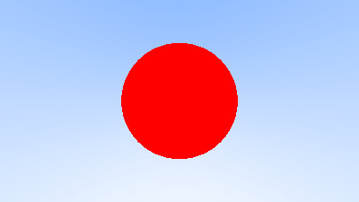

jpg version:

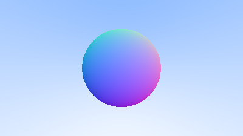

jpg version:

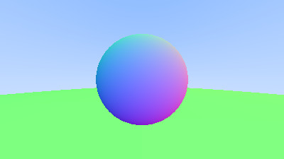

jpg version:

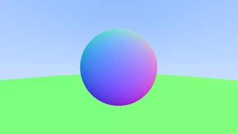

jpg version:

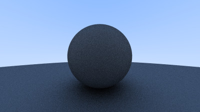

jpg version:

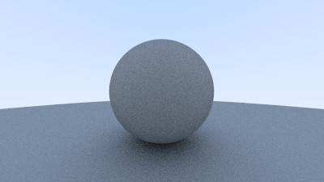

jpg version:

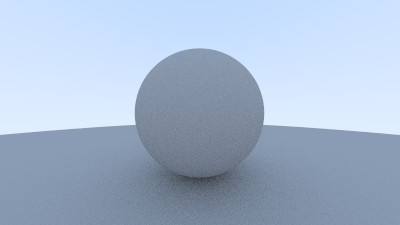

jpg version:

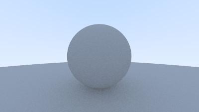

jpg version:

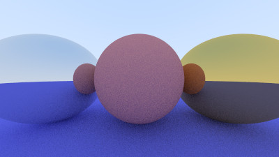

jpg version:

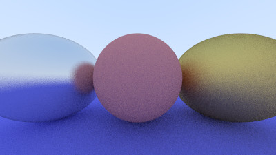

jpg version:

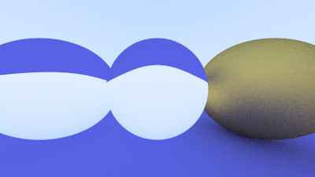

jpg version:

jpg version:

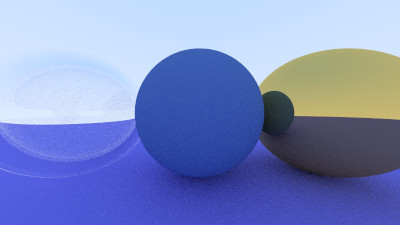

jpg version:

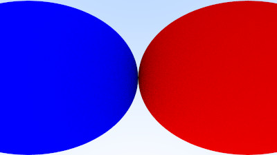

jpg version:

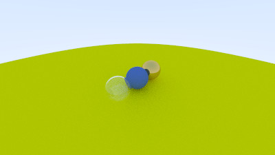

jpg version:

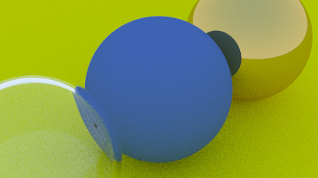

jpg version:

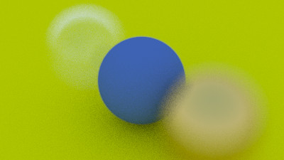

jpg version:

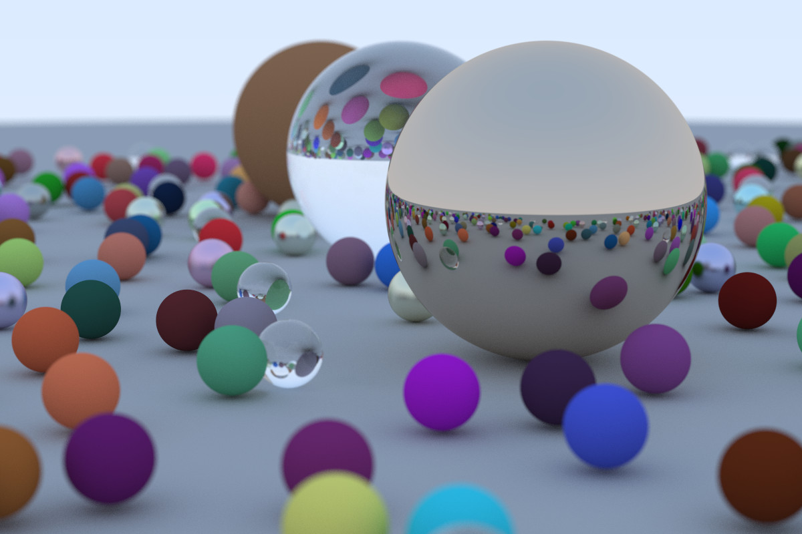

jpg version:

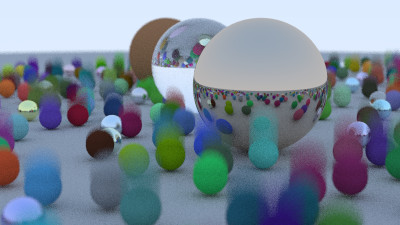
